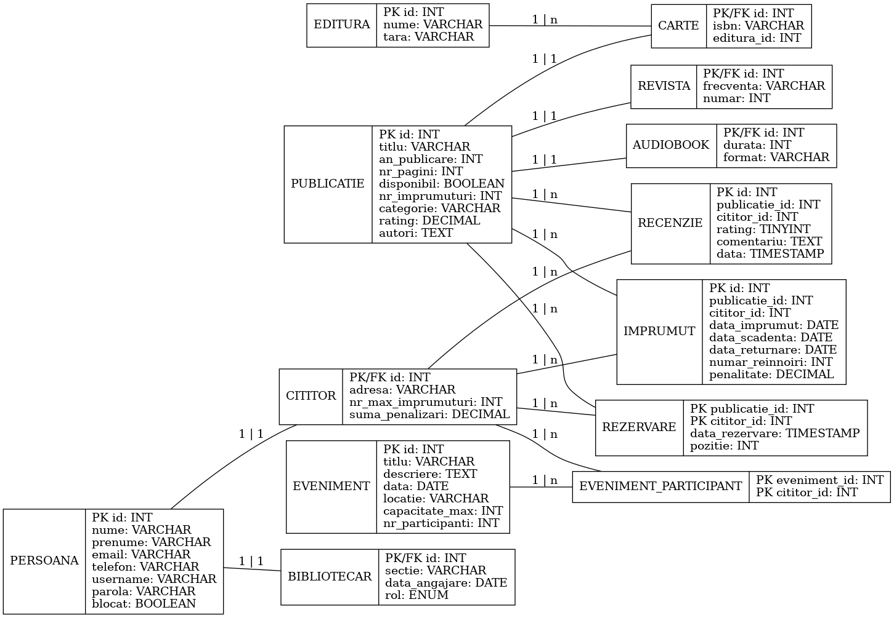

# 🏛️ **SmartLibrary**

### Java 21 · MySQL 8 · Maven 3.9 · JDBC

*All‑in‑one toolchain for next‑gen library management*

> **SmartLibrary aduce vibe‑ul digital în bibliotecă**: catalogare instant, împrumuturi fără fricțiune, cozi FIFO transparente și evenimente culturale integrate. Totul orchestrat printr‑un CLI elegant, cu audit live și securitate *iron‑clad*.

---

## 📖 Cuprins

- [Caracteristici](#caracteristici)
- [Instalare rapidă](#instalare-rapidă)
- [Diagramă BD](#diagramă-bd)
- [Arhitectură](#arhitectură)
- [Model de domeniu](#model-de-domeniu)
- [CLI](#cli)
- [Cum funcționează](#cum-funcționează)
- [Stack & Pattern‑uri](#stack--pattern‑uri)
- [Roadmap](#roadmap)
- [Licență](#licență)

---

## ✨ Caracteristici

| 🚀  | Feature                                                      |
| --- | ------------------------------------------------------------ |
| 💾  | Persistență **MySQL 8 + JDBC** (repository generic)          |
| 🔒  | Hashing parole cu **BCrypt** (12 rounds)                     |
| 🛠️ | Creare / resetare automată schemă la start‑up                |
| 📝  | Audit **asincron** (`EventBus → AuditService` → `audit.csv`) |
| 🚀  | Cache în memorie pentru evenimente populare                  |
| ⌨️  | **38 comenzi CLI** (funcționalități complete)                |
| 🧪  | Teste unitare **JUnit 5 + Mockito**                          |
| 💬  | UI text‑based prietenoasă, cu highlight pe interacțiuni      |

---

## ⚙️ Instalare rapidă

```bash
# 1️⃣ Clonare
git clone https://github.com/username/SmartLibrary.git
cd SmartLibrary

# 2️⃣ Build
mvn clean package

# 3️⃣ Pornire
java -jar target/smartlibrary.jar
```

> ▶️ La prima rulare, aplicația creează automat baza de date (dacă nu există) și populează date demo.

---

## 🗂️ Diagramă BD



## 🏗️ Arhitectură

```
               ┌──────────┐  commands   ┌────────────────┐
               │   CLI    │ ───────────►│ Service Layer  │
               └──────────┘             └────────────────┘
                                          │  ▲
                              cache hit   │  │  cache miss / JDBC
                                          │  │
                                          ▼  │
                                        ┌──────────┐
                                        │  Cache   │
                                        └──────────┘
                                          │
                                          ▼
               ┌──────────┐  JDBC   ┌────────────────┐
               │ MySQL 8  │ ◄────── │  Repository    │
               └──────────┘         └────────────────┘
                                          │
                                   events │
                                          ▼
                                        ┌──────────┐
                                        │ EventBus │
                                        └──────────┘
                                          │
                                          ▼
                                        ┌──────────┐
                                        │ AuditSvc │
                                        └──────────┘
```

- **Layered** – UI ▸ Service ▸ Repository ▸ DB
- **Cache** – evenimente populare păstrate in‑memory
- **Audit asincron** – EventBus ⇒ Audit Service
- **Patterns** – Singleton · Factory · Builder · Repository · Strategy · CoR · Observer

---

## 🧩 Model de domeniu

| Entitate          | Cheie                        | Tabel                  |
| ----------------- | ---------------------------- | ---------------------- |
| 📗 Carte          | ISBN, Editură                | `carte`                |
| 📰 Revistă        | Frecvență, Număr             | `revista`              |
| 🎧 Audiobook      | Durată, Naratori             | `audiobook`            |
| 🙋 Cititor        | Împrumuturi, Penalizări      | `cititor`              |
| 👩‍💼 Bibliotecar | Rol (`STAFF` / `ADMIN`)      | `bibliotecar`          |
| 🔄 Împrumut       | Dată start / end, penalitate | `imprumut`             |
| ⏳ Rezervare       | Cozi FIFO                    | `rezervare_publicatie` |
| ⭐ Recenzie        | Rating, comentariu           | `recenzie`             |
| 📆 Eveniment      | Dată, Locație, Capacitate    | `eveniment`            |
| 🏢 Editura        | Record imutabil              | `editura`              |

---

## ⌨️ CLI

### 👩‍💼 Bibliotecar — Admin & Staff

```text
1.  📚  Listare toate publicatiile
2.  🔍  Cautare dupa titlu
3.  🖋️  Cautare dupa autor
4.  🏷️  Cautare dupa categorie
5.  📅  Cautare dupa interval de ani
6.  ✅  Cautare dupa disponibilitate
7.  🧩  Cautare complexa
8.  🗓️  Sorteaza dupa anul publicarii
9.  ⭐  Sorteaza dupa rating
10. 🔢  Sorteaza dupa nr. de imprumuturi
11. 🔠  Sorteaza dupa titlu
12. 📖  Imprumuta publicatie
13. 📝  Afiseaza recenziile unui cititor
14. 📝  Afiseaza recenziile unei publicatii
15. 🎟️  Listare evenimente
16. 📂  Vizualizare imprumuturi active (cititor)
17. 🗄️  Vizualizare istoric imprumuturi (cititor)
18. 💸  Vizualizare amenzi (cititor)
19. ➕  Adauga publicatie
20. ❌  Sterge publicatie
21. ✨  Creeaza eveniment
22. 🗑️  Sterge eveniment
23. 🔒  Blocheaza utilizator
24. 🔓  Deblocheaza utilizator
25. 👥  Adauga bibliotecar STAFF
0.  🚪  Logout
```

### 🙋 Cititor

```text
1.  📚  Listare toate publicatiile
2.  🔍  Cautare dupa titlu
3.  🖋️  Cautare dupa autor
4.  🏷️  Cautare dupa categorie
5.  📅  Cautare dupa interval de ani
6.  ✅  Cautare dupa disponibilitate
7.  🧩  Cautare complexa
8.  🗓️  Sorteaza dupa anul publicarii
9.  ⭐  Sorteaza dupa rating
10. 🔢  Sorteaza dupa nr. de imprumuturi
11. 🔠  Sorteaza dupa titlu
12. 📖  Imprumuta publicatie
13. ↩️  Returneaza publicatie
14. 📌  Rezerva publicatie
15. 🔄  Reinnoieste imprumut
16. ✍️  Adauga recenzie
17. 🗣️  Afiseaza recenzii
18. 🎟️  Listare evenimente
19. 🖊️  Inscriere la eveniment
20. 📂  Vizualizare imprumuturi active
21. 🗄️  Vizualizare istoric imprumuturi
22. 💸  Vizualizare amenzi
0.  🚪  Logout
```

---

## 🔍 Cum funcționează

1. **CreeazaTabele** generează (sau resetează) schema la fiecare pornire.
2. CLI‑ul ridică comenzi către **Service Layer**; aici se fac validările și se declanșează tranzacții JDBC.
3. Fiecare acțiune se loghează ca eveniment → **EventBus** → **AuditService** (thread dedicat).
4. Securitatea parolelor este asigurată de **BCrypt** (12 rounds).

---

## 🧰 Stack & Pattern‑uri

| Stack                 | Utilizare                                                              |
| --------------------- | ---------------------------------------------------------------------- |
| **Java 21**           | Records · pattern matching · Stream API                                |
| **MySQL 8 + JDBC**    | Persistență relațională ↓ CRUD                                         |
| **BCrypt**            | Hashing parole                                                         |
| **JUnit 5 + Mockito** | Testare                                                                |
| **Patterns**          | Singleton · Factory · Builder · Repository · Strategy · CoR · Observer |

---

## 🗺️ Roadmap

- 🌐 Modul **REST** (Spring Boot)
- 🖥️ UI **React**
- ♻️ *Hot‑reloading* cu **JRebel**
- 🐳 **Docker** & orchestrare **Kubernetes**
- 📈 Monitorizare **Prometheus + Grafana**
- ☁️ Deploy **AWS / Azure**

---


## 📝 Licență

© 2025 SmartLibrary. Toate drepturile rezervate. Este interzisă copierea, redistribuirea sau modificarea acestui software fără permisiunea scrisă a autorilor.

